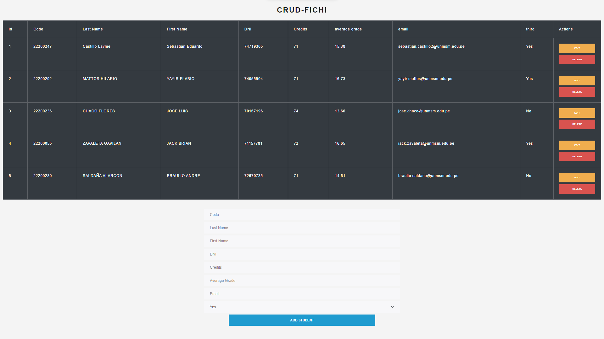

# Proyecto con express y typescript.



Express es un framework de Node.js que te permite crear aplicaciones web y API REST de forma rápida y sencilla. TypeScript es un lenguaje de programación que añade tipos estáticos a JavaScript, lo que te ayuda a escribir código más seguro y legible.

1. Crea una carpeta para tu proyecto y abre una terminal en ella.
2. Ejecuta el comando `npm init -y` para generar un archivo `package.json` con la configuración básica de tu proyecto.
3. Instala express y typescript como dependencias de tu proyecto con el comando `npm install express typescript --save`.
4. Instala también las definiciones de tipos de express y node con el comando `npm install @types/express @types/node --save-dev`. Estas dependencias te permitirán usar el autocompletado y la detección de errores de TypeScript con express y node.
5. Ejecuta el comando `npx tsc --init` para generar un archivo `tsconfig.json` con la configuración de TypeScript para tu proyecto. Puedes modificar este archivo según tus preferencias, pero te recomiendo que cambies el valor de `outDir` a `"./dist"` para que los archivos JavaScript generados por TypeScript se guarden en una carpeta llamada `dist`.
6. Crea una carpeta llamada `src` y dentro de ella un archivo llamado `index.ts`. Este será el punto de entrada de tu aplicación.
7. Escribe el siguiente código en el archivo `index.ts` para crear un servidor con express que responda con un mensaje de "Hola mundo" al recibir una petición GET en la ruta raíz:

```typescript
import express from 'express';

// Crear una instancia de express
const app = express();

// Definir el puerto donde escuchará el servidor
const PORT = 3000;

// Definir una ruta GET para la raíz
app.get('/', (req, res) => {
	// Enviar una respuesta con el mensaje "Hola mundo"
	res.send('Hola mundo');
});

// Iniciar el servidor
app.listen(PORT, () => {
	console.log(`Servidor escuchando en el puerto ${PORT}`);
});
```

8. Para ejecutar tu aplicación, puedes usar el paquete `ts-node`, que te permite ejecutar TypeScript directamente en node sin tener que transpilarlo a JavaScript. Instala `ts-node` con el comando `npm install ts-node --save-dev` y luego ejecuta el comando `npx ts-node src/index.ts`. Deberías ver el mensaje `Servidor escuchando en el puerto 3000` en la terminal y si abres un navegador y accedes a la dirección `http://localhost:3000`, deberías ver el mensaje `Hola mundo` en la pantalla.
9. Si quieres transpilar tu código TypeScript a JavaScript, puedes usar el comando `npx tsc` para generar los archivos JavaScript en la carpeta `dist`. Luego, puedes ejecutar tu aplicación con el comando `node dist/index.js`.
10. Para facilitar el desarrollo, puedes crear unos scripts en el archivo `package.json` para ejecutar y transpilar tu aplicación con un solo comando. Por ejemplo, puedes añadir los siguientes scripts:

```json
"scripts": {
  "start": "ts-node src/index.ts",
  "build": "tsc",
  "serve": "node dist/index.js"
}
```

Luego, puedes ejecutar tu aplicación con el comando `npm start`, transpilarla con el comando `npm run build` y servirla con el comando `npm run serve`.
